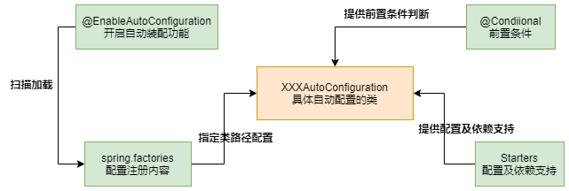

[TOC]

Spring Boot 的核心运行原理

spring boot的核心功能是自动配置，那么自动配置的实现是什么？是怎么实现约定优于配置的。

本章内容设计 自动配置原理，核心功能模块，核心注解以及用到的核心源码分析；

# 2.1 核心运行原理

自动配置的运行原理

- @EnableAutoConfiguration 该注解由组合注解SpringBootApplication引入，完成自动配置开启，扫描各jar包下的spring.factories文件，并加载注册文件中配置的AutoConfiguration类等；
- spring.factories 配置文件，位于jar包的META-INF目录下，按照指定格式注册自动配置的AutoConfiguration类，也可以在文件中协商其他类型待注册的类；
- AutoConfiguration 类，自动配置类，定义了第三方组件集成spring所需的初始化的bean和条件；
- @Conditional 条件注解，在AutoConfiguration类上使用，控制当满足该条件的时候，才实例化该AutoConfiguration类；
- Starters：第三方组件的依赖和配置，为springboot中预置的组件项目，只包含了一个pom依赖的项目，可以帮助第三方组件解决部分依赖功能；

# 2.2 运作原理源码解析之 @EnableAutoConfiguration