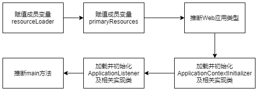

[TOC]

本章围绕SprinApplication的静态方法 -run方法初始化类SpringApplication自身的功能进行详解；

# 3.1 SpringApplication 初始化简介

静态方法run的具体细节

```java
@SpringBootApplication
public class DemoApplication {
    public static void main(String[] args) {
        SpringApplication.run(DemoApplication.class, args);
    }
}
```

```java
public static ConfigurableApplicationContext run(Class<?> primarySource, String... args) {
		return run(new Class<?>[] { primarySource }, args);
	}

public static ConfigurableApplicationContext run(Class<?>[] primarySources, String[] args) {
		return new SpringApplication(primarySources).run(args);
	}

```

综上 run方法等价与：

```java
@SpringBootApplication
public class DemoApplication {
    public static void main(String[] args) {
        // SpringApplication.run(DemoApplication.class, args);
        SpringApplication demoApp = new SpringApplication(DemoApplication.class);
        demoApp.run(args);
    }
}
```

这里有多个primarySources是什么意思？怎么使用？

# 3.2 SpringApplication 实例化流程

继续展示上述SpringApplication的构造方法源码：

```java
public SpringApplication(Class<?>... primarySources) {
		this(null, primarySources);
	}
	
public SpringApplication(ResourceLoader resourceLoader, Class<?>... primarySources) {
		this.resourceLoader = resourceLoader;
		Assert.notNull(primarySources, "PrimarySources must not be null");
		this.primarySources = new LinkedHashSet<>(Arrays.asList(primarySources));
		this.webApplicationType = WebApplicationType.deduceFromClasspath();
		setInitializers((Collection) getSpringFactoriesInstances(ApplicationContextInitializer.class));
		setListeners((Collection) getSpringFactoriesInstances(ApplicationListener.class));
		this.mainApplicationClass = deduceMainApplicationClass();
	}
```

核心流程图



Web应用类型有哪些？指的什么意思？

# 3.3 SpringApplication 构造方法参数

SpringAppication的核心构造方法有两个参数，第一个为ResourceLoader，第二个为Class<?>...primarySources;

第一个参数：resourceLoader参数为资源加载的接口，在spring boot启动的时打印banner(横幅)信息，默认采用的是DefaultResourceLoader；

第二个参数：Class<?>...primarySources，为可变变量，默认传入的是springboot入口类；如果作为项目的引导类，此参数需要满足一个条件，即被注解@EnableAutoConfiguration或者其作何注解标注。也可以传入其他普通类，但只有传入被@EnableAutoConfiguraion标注的类才能开启SpringBoot的自动配置。

可以有如下使用方式：

```java
@SpringBootApplication
public class OtherApplication{

}

public class SpringLearnApplication{
    public static main(String[]args){
        new SpringApplication(OtherApplication.class).run(args);
    }
}
```

在实例化SpringApplication的过程中，并没有对primarySources做复杂的处理，只是将其转换为Set集合，并赋值给私有成员变量；


# 3.4 Web应用类型推断

web应用类型判断是通过

```java
this.webApplicationType = WebApplicationType.deduceFromClasspath();
```

枚举类型有如下几种：

```java
public enum WebApplicationType {

   /**
    * The application should not run as a web application and should not start an
    * embedded web server.
    */
   NONE,

   /**
    * The application should run as a servlet-based web application and should start an
    * embedded servlet web server.
    */
   SERVLET,

   /**
    * The application should run as a reactive web application and should start an
    * embedded reactive web server.
    */
   REACTIVE;
    
   }
```

推断方法如下：

```java
private static final String[] SERVLET_INDICATOR_CLASSES = { "javax.servlet.Servlet",
      "org.springframework.web.context.ConfigurableWebApplicationContext" };

private static final String WEBMVC_INDICATOR_CLASS = "org.springframework.web.servlet.DispatcherServlet";

private static final String WEBFLUX_INDICATOR_CLASS = "org.springframework.web.reactive.DispatcherHandler";

private static final String JERSEY_INDICATOR_CLASS = "org.glassfish.jersey.servlet.ServletContainer";

private static final String SERVLET_APPLICATION_CONTEXT_CLASS = "org.springframework.web.context.WebApplicationContext";

private static final String REACTIVE_APPLICATION_CONTEXT_CLASS = "org.springframework.boot.web.reactive.context.ReactiveWebApplicationContext";

static WebApplicationType deduceFromClasspath() {
   if (ClassUtils.isPresent(WEBFLUX_INDICATOR_CLASS, null) && !ClassUtils.isPresent(WEBMVC_INDICATOR_CLASS, null)
         && !ClassUtils.isPresent(JERSEY_INDICATOR_CLASS, null)) {
      return WebApplicationType.REACTIVE;
   }
   for (String className : SERVLET_INDICATOR_CLASSES) {
      if (!ClassUtils.isPresent(className, null)) {
         return WebApplicationType.NONE;
      }
   }
   return WebApplicationType.SERVLET;
}
```

方法deduceFromClasspath是判断指定的类是否存在于classpath下，并根据判断的结果进行组合推断应用属于什么类型。

其中用到了ClassUtis.isPresent方法，其核心机制为通过反射创建指定的类，根据创建过程中是否抛出异常判断该类是否存在。

```java
public static boolean isPresent(String className, @Nullable ClassLoader classLoader) {
		try {
			forName(className, classLoader);
			return true;
		}
		catch (IllegalAccessError err) {
			throw new IllegalStateException("Readability mismatch in inheritance hierarchy of class [" +
					className + "]: " + err.getMessage(), err);
		}
		catch (Throwable ex) {
			// Typically ClassNotFoundException or NoClassDefFoundError...
			return false;
		}
	}
```

deduceFromClaspath的判断逻辑如下：

- 当DispatcherHandler 存在，并且DispatcherServlet和ServletContainer都不存在，返回类型 REACTIVE；
- 当Servlet和ConfigurableWebApplicationContext任一个不存在的时候，就返回NONE类型；
- 当上述都不满足，范围SERVLET类型；


# 3.5 ApplicationContextInitializer 加载

ApplicationContextInitializer 接口是SpringIOC容器提供的一个接口，是一个回调接口，主要目的是允许用户在ConfigurableApplicationContext类型的ApplicationContext做refresh方法调用刷新前，对ApplicationContext实例做进一步的设置或处理。通常用于应用程序上下文进行编程初始化的web应用程序中。

ApplicationContextInitializer 接口只定义了一个initialize方法，代码如下：

```java
public interface ApplicationContextInitializer<C extends ConfigurableApplicationContext> {

   /**
    * Initialize the given application context.
    * @param applicationContext the application to configure
    */
   void initialize(C applicationContext);
}
```

initialize方法主要用于初始化指定的上下文，对应的上下文实例由参数作为输入；

在完成Web应用类型的推断之后，ApplicationContextInitializer便开始进行加载工作，可分为两个步骤，获取相关的实例和设置实例。对应的方法分别为getSpringFactoriesInstances和setInitializers；

```java
private <T> Collection<T> getSpringFactoriesInstances(Class<T> type) {
   return getSpringFactoriesInstances(type, new Class<?>[] {});
}

private <T> Collection<T> getSpringFactoriesInstances(Class<T> type, Class<?>[] parameterTypes, Object... args) {
   ClassLoader classLoader = getClassLoader();
   // Use names and ensure unique to protect against duplicates
   Set<String> names = new LinkedHashSet<>(SpringFactoriesLoader.loadFactoryNames(type, classLoader));
   List<T> instances = createSpringFactoriesInstances(type, parameterTypes, classLoader, args, names);
   AnnotationAwareOrderComparator.sort(instances);
   return instances;
}
```

getSpringFactoriesInstances 方法是通过SpringFactoriesLoader类的loadFactoryNames方法来获得META-INF/spring.factories文件中注册的对应配置；在spring-boot:2.3.5版本中

```shell
# Application Context Initializers
org.springframework.context.ApplicationContextInitializer=\
org.springframework.boot.context.ConfigurationWarningsApplicationContextInitializer,\
org.springframework.boot.context.ContextIdApplicationContextInitializer,\
org.springframework.boot.context.config.DelegatingApplicationContextInitializer,\
org.springframework.boot.rsocket.context.RSocketPortInfoApplicationContextInitializer,\
org.springframework.boot.web.context.ServerPortInfoApplicationContextInitializer
```

配置代码中等号后面的为接口ApplicationContextInitializer的具体实现类；当获取到类的全限定名后，通过createSpringFactoriesInstances方法进行相关的实例化操作；

```java
private <T> List<T> createSpringFactoriesInstances(Class<T> type, Class<?>[] parameterTypes,
      ClassLoader classLoader, Object[] args, Set<String> names) {
   List<T> instances = new ArrayList<>(names.size());
   for (String name : names) {
      try {
         Class<?> instanceClass = ClassUtils.forName(name, classLoader);
         Assert.isAssignable(type, instanceClass);
         Constructor<?> constructor = instanceClass.getDeclaredConstructor(parameterTypes);
         T instance = (T) BeanUtils.instantiateClass(constructor, args);
         instances.add(instance);
      }
      catch (Throwable ex) {
         throw new IllegalArgumentException("Cannot instantiate " + type + " : " + name, ex);
      }
   }
   return instances;
}
```

setInitializers将获取到的实例集合添加到SpringApplication的成员变量initializers中，

```java
public void setInitializers(Collection<? extends ApplicationContextInitializer<?>> initializers) {
   this.initializers = new ArrayList<>(initializers);
}
```

这里是创建了一个新的list后，直接赋值覆盖，使用时需注意。

## 3.5.2 实例详解

自定义一个ApplicationContextinitializer接口的实现类，并通过配置使其生效。

```java
public class LearnApplicationInitializer implements ApplicationContextInitializer {
    @Override
    public void initialize(ConfigurableApplicationContext applicationContext) {
        System.out.println("There are beans count:" + applicationContext.getBeanDefinitionCount() + " in spring container.");
    }
}
```

有3中方式可以是该类生效

第一种：参考spring-boot源码中的操作，将该类配置于META-INF/spring.factories中；

第二种：在application.yml或application.properties文件中配置，

```shell
context.initializer.classes=org.example.sb.ch3.initializer.LearnApplicationInitializer
```

这种方法是通过DelegationApplicationContextInitializer类中的initialize方法获取配置文件中的context.initializer.classes值，并执行相关的initialize方法；

第三种：通过SpringApplication的addInitializers方法追加配置；

通过以上三种方法的任一种都可以在控制台看到加载的bean的数量；


# 3.6 ApplicationListener 加载

完成ApplicationContextInitializer的加载后，便会进行ApplicationListener的加载，它的常见场景为：当容器初始化完成之后，需要处理一些如数据据的加载，初始化缓存，特定任务的注册等操作。

Spring时间传播机制是基于观察者模式实现的，比如ApplicationContext管理bean的生命周期的过程中，会将一些改变定义为事件ApplicationEvent，ApplicationContext通过ApplicationListener监听ApplicationEvent，当事件被发布后，ApplicationListener对事件做出具体的操作；


ApplicationListener的配置和加载流程与ApplicationContextInitializer完全一致，首先通过SpringFactoriesLoader.loadFactoryNames方法获取META-INF/spring.factories中的对ApplicationListener的配置，然后进行实例化，最后添加到SpringApplication的成员变量listeners中；


ApplicationListener的基本用法，ApplicationListener和ApplicationEvent类配合使用，可实现ApplicationContext的事件处理，如果容器中存在ApplicationListener的bean，当ApplicationContext调用publishEvent方法时，对应的bean就会被触发，这就是上文提到的观察者模式。


AplicationListener只定义了一个onApplicationEvent方法，当监听的事件被触发的时候，该方法就会被执行，

```java
public interface ApplicationListener<E extends ApplicationEvent> extends EventListener {

   /**
    * Handle an application event.
    * @param event the event to respond to
    */
   void onApplicationEvent(E event);
}
```

onApplicationEvent一般用于处理应用程序事件，参数event为具体的事件；

当ApplicationContext被初始化或者刷新时，会触发事件ContextRefreshedEvent，下面我们定义一个监听器监听事件的发生，代码如下：

```java
@Component
public class LearnListener implements ApplicationListener<ContextRefreshedEvent> {
    @Override
    public void onApplicationEvent(ContextRefreshedEvent event) {
        System.out.println("There ara bean count:" + event.getApplicationContext().getBeanDefinitionCount() + " in listener when refresh context.");
    }
}
```

尝试自定义监听器实现？

# 3.7 入口类推断

创建SpringApplication的最后一步便是推断入口类，我们通过调用自身的deduceMainApplicationClass方法来进行入口类的推断；

```java
private Class<?> deduceMainApplicationClass() {
   try {
      StackTraceElement[] stackTrace = new RuntimeException().getStackTrace();
      for (StackTraceElement stackTraceElement : stackTrace) {
         if ("main".equals(stackTraceElement.getMethodName())) {
            return Class.forName(stackTraceElement.getClassName());
         }
      }
   }
   catch (ClassNotFoundException ex) {
      // Swallow and continue
   }
   return null;
}
```

该方法的原理是，先创建一个异常，然后获取栈数组，遍历栈数组判断类的方法中是否包含main方法；第一个被匹配到的类会通过Class.forName方法创建对象，并将其返回，最后将对象赋值给SpringApplication的成员变量。


# 3.8 SpringApplication的定制化配置

关于定制化的配置，springboot提供了如基于入口类的，配置文件，环境变量，命令行参数等多种形式；

# 3.8.1 基础配置

基础配置与配置文件application.properties中的配置一样，用于修改预设的配置，如不打印banner信息，配置文件中配置 spring.main.banner-mode=off，来关闭，也可以通过SpringApplication提供的对应方法来关闭：

```java
@SpringBootApplication
public class DemoApplication {
    public static void main(String[] args) {
        // SpringApplication.run(DemoApplication.class, args);
        SpringApplication demoApp = new SpringApplication(DemoApplication.class);
        demoApp.addInitializers(new LearnApplicationInitializer());
        // 关闭banner
        demoApp.setBannerMode(Banner.Mode.OFF);
        demoApp.run(args);
    }
}
```

不过，不建议在启动类中配置过多的配置项，不方便集中式的管理。

## 3.8.2 配置源配置

除了直接通过setter方法进行参数配置外，还可以通过设置配置源参数对整个配置文件或配置类进行配置，有两种实现途径：SpringApplication的构造方法参数，或者SpringApplication的setSources方法；

第一种：可以在SpringApplication的构造方法中的参数primarySources中传递对应的配置类，但这种方法有一个弊端是，不能指定xml文件和基于package的配置；

另一种：setSources方法，该方法的参数为字符串集合，可传递类名，package名，和xml配置资源。下面与类名为例：

1.定义一个没加Configuration注解的配置类

```java
public class WithoutAnnoConfiguration {
    public WithoutAnnoConfiguration() {
        System.out.println("Create WithoutAnnoConfiguration instance.");
    }

    @Value("${admin.name}")
    private String name;

    @Value("${admin.age}")
    private int age;

    public String getName() {
        return name;
    }

    public void setName(String name) {
        this.name = name;
    }

    public int getAge() {
        return age;
    }

    public void setAge(int age) {
        this.age = age;
    }

    @Override
    public String toString() {
        return "WithoutAnnoConfiguration{" +
                "name='" + name + '\'' +
                ", age=" + age +
                '}';
    }
}
```

2.配置文件 application.properties中配置：

```properties
admin.name=shch
admin.age=18
```

3.通过setsources方法，设置该配置类到SpringApplication中：

```java
@SpringBootApplication
public class DemoApplication {
    public static void main(String[] args) {
        // SpringApplication.run(DemoApplication.class, args);
        SpringApplication demoApp = new SpringApplication(DemoApplication.class);
        demoApp.addInitializers(new LearnApplicationInitializer());
        // 关闭banner
        //  demoApp.setBannerMode(Banner.Mode.OFF);
        // 设置source
        Set<String> sources = new HashSet<>();
        sources.add(WithoutAnnoConfiguration.class.getName());
        demoApp.setSources(sources);

        ConfigurableApplicationContext context = demoApp.run(args);

        WithoutAnnoConfiguration withoutBean = context.getBean(WithoutAnnoConfiguration.class);
        System.out.println(withoutBean);
    }
}
```

4.运行程序即可看到，该配置类的初始化过程，和打印的该类的对象信息：

```shell
There are beans count:5 in spring container when initializer.
2021-05-06 19:26:24.860  INFO 7148 --- [           main] org.example.sb.DemoApplication           : Starting DemoApplication on DESKTOP-K5FDARB with PID 7148 (D:\code\spring-boot-book\spring-boot-demo\target\classes started by shichao in D:\code\spring-boot-book)
2021-05-06 19:26:24.860  INFO 7148 --- [           main] org.example.sb.DemoApplication           : No active profile set, falling back to default profiles: default
2021-05-06 19:26:25.860  INFO 7148 --- [           main] o.s.b.w.embedded.tomcat.TomcatWebServer  : Tomcat initialized with port(s): 8080 (http)
2021-05-06 19:26:25.876  INFO 7148 --- [           main] o.apache.catalina.core.StandardService   : Starting service [Tomcat]
2021-05-06 19:26:25.876  INFO 7148 --- [           main] org.apache.catalina.core.StandardEngine  : Starting Servlet engine: [Apache Tomcat/9.0.39]
2021-05-06 19:26:25.954  INFO 7148 --- [           main] o.a.c.c.C.[Tomcat].[localhost].[/]       : Initializing Spring embedded WebApplicationContext
2021-05-06 19:26:25.954  INFO 7148 --- [           main] w.s.c.ServletWebServerApplicationContext : Root WebApplicationContext: initialization completed in 1016 ms
Create WithoutAnnoConfiguration instance.
I am import-selector bean: will before config bean.
I am config bean.
2021-05-06 19:26:26.297  INFO 7148 --- [           main] o.s.s.concurrent.ThreadPoolTaskExecutor  : Initializing ExecutorService 'applicationTaskExecutor'
I am deferred import-selector bean:will after config bean.
2021-05-06 19:26:26.469  INFO 7148 --- [           main] o.s.b.w.embedded.tomcat.TomcatWebServer  : Tomcat started on port(s): 8080 (http) with context path ''
There ara bean count:131 in listener when refresh context.
2021-05-06 19:26:26.485  INFO 7148 --- [           main] org.example.sb.DemoApplication           : Started DemoApplication in 2.184 seconds (JVM running for 3.272)
WithoutAnnoConfiguration{name='shch', age=18}
```

无论是通过构造参数的形式，还是setSources的方式，Springboot都会对其合并，SpringApplication提供了一个合并方法getAllSources()：

```java
public Set<Object> getAllSources() {
   Set<Object> allSources = new LinkedHashSet<>();
    // primarySources不为空，就加入
   if (!CollectionUtils.isEmpty(this.primarySources)) {
      allSources.addAll(this.primarySources);
   }
    // sources不为空，就加入
   if (!CollectionUtils.isEmpty(this.sources)) {
      allSources.addAll(this.sources);
   }
   return Collections.unmodifiableSet(allSources);
}
```


# 3.9 小结

本章重点围绕SpringApplication的类的初始化过程展开，详细接受了在初始化过程中SpringBoot进行的操作：web应用类型判断，入口类判断，默认的ApplicationContextInitializer接口加载，默认的ApplicationListener加载，SpringApplication类的参数惩治功能，以及针对这些操作我们能够进行自定义组件及配置；建议大家在后续的配合相应的实战，获得更好的学习效果。