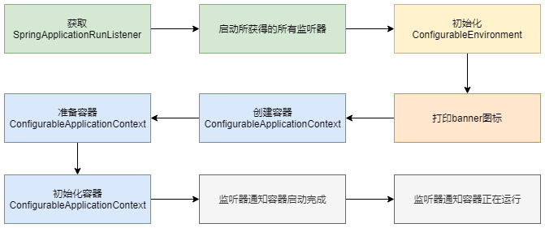

[TOC]

上一章分析了SpringApplication的实例化的源码，完成了基本配置文件的加载和实例化

当SpringApplication对象被创建后，通过调用其run方法来进行SpringBoot的启动和运行，正式开启SpringApplication的生命周期；

本章围绕SpringApplicationRunListeners,ApplicationArguments,ConfigurableEnvironment以及应用上下文信息等；

# 4.1 run方法的核心流程



重点有如下操作：

1. 获取监听器和参数配置；
2. 打印banner信息；
3. 创建并初始化容器；
4. 监听器发送通知；

```java
public ConfigurableApplicationContext run(String... args) {
   StopWatch stopWatch = new StopWatch();
   stopWatch.start();
   ConfigurableApplicationContext context = null;
   Collection<SpringBootExceptionReporter> exceptionReporters = new ArrayList<>();
   configureHeadlessProperty();
   SpringApplicationRunListeners listeners = getRunListeners(args);
   listeners.starting();
   try {
      ApplicationArguments applicationArguments = new DefaultApplicationArguments(args);
      ConfigurableEnvironment environment = prepareEnvironment(listeners, applicationArguments);
      configureIgnoreBeanInfo(environment);
      Banner printedBanner = printBanner(environment);
      context = createApplicationContext();
      exceptionReporters = getSpringFactoriesInstances(SpringBootExceptionReporter.class,
            new Class[] { ConfigurableApplicationContext.class }, context);
      prepareContext(context, environment, listeners, applicationArguments, printedBanner);
      refreshContext(context);
      afterRefresh(context, applicationArguments);
      stopWatch.stop();
      if (this.logStartupInfo) {
         new StartupInfoLogger(this.mainApplicationClass).logStarted(getApplicationLog(), stopWatch);
      }
      listeners.started(context);
      callRunners(context, applicationArguments);
   }
   catch (Throwable ex) {
      handleRunFailure(context, ex, exceptionReporters, listeners);
      throw new IllegalStateException(ex);
   }

   try {
      listeners.running(context);
   }
   catch (Throwable ex) {
      handleRunFailure(context, ex, exceptionReporters, null);
      throw new IllegalStateException(ex);
   }
   return context;
}
```


# 4.2 SpringApplicationRunListener监听器

## 4.2.1 监听器的配置和加载

SpringApplicationRunListeners可以理解为一个SpringApplicationRunListener的容器，它将SpringApplicationRunListener的集合以构造方法传入，并赋值给其listeners变量，然后提供了针对listeners成员变量的各种遍历操作方法，如staring，started，running等；

```java
private SpringApplicationRunListeners getRunListeners(String[] args) {
   Class<?>[] types = new Class<?>[] { SpringApplication.class, String[].class };
   return new SpringApplicationRunListeners(logger,
         getSpringFactoriesInstances(SpringApplicationRunListener.class, types, this, args));
}
```

```java
private <T> Collection<T> getSpringFactoriesInstances(Class<T> type, Class<?>[] parameterTypes, Object... args) {
   ClassLoader classLoader = getClassLoader();
   // Use names and ensure unique to protect against duplicates
   Set<String> names = new LinkedHashSet<>(SpringFactoriesLoader.loadFactoryNames(type, classLoader));
   List<T> instances = createSpringFactoriesInstances(type, parameterTypes, classLoader, args, names);
   AnnotationAwareOrderComparator.sort(instances);
   return instances;
}
```

```java
private <T> List<T> createSpringFactoriesInstances(Class<T> type, Class<?>[] parameterTypes,
      ClassLoader classLoader, Object[] args, Set<String> names) {
   List<T> instances = new ArrayList<>(names.size());
   for (String name : names) {
      try {
         Class<?> instanceClass = ClassUtils.forName(name, classLoader);
         Assert.isAssignable(type, instanceClass);
         Constructor<?> constructor = instanceClass.getDeclaredConstructor(parameterTypes);
         T instance = (T) BeanUtils.instantiateClass(constructor, args);
         instances.add(instance);
      }
      catch (Throwable ex) {
         throw new IllegalArgumentException("Cannot instantiate " + type + " : " + name, ex);
      }
   }
   return instances;
}
```

通过SpringFactoriesLoader获取META-INF/spring.factories中对应的配置，spring-boot默认只有一个listener，EventPublishingRunListener；

从上述获取和创建listener的时候，要求listener默认的构造方法点的参数以此为

```java
   Class<?>[] types = new Class<?>[] { SpringApplication.class, String[].class };
```

## 4.2.2 SpringApplicationRunListener源码解析

```java
public interface SpringApplicationRunListener {

   /**
    * Called immediately when the run method has first started. Can be used for very
    * early initialization. 当run方法第一次被执行时，会立即被调用，可用于非常早期的初始化工作
    */
   default void starting() {
   }

   /**
    * Called once the environment has been prepared, but before the
    * {@link ApplicationContext} has been created.
    * 当environment准备完成，在ApplicationContext创建之前，被调用
    * @param environment the environment
    */
   default void environmentPrepared(ConfigurableEnvironment environment) {
   }

   /**
    * Called once the {@link ApplicationContext} has been created and prepared, but
    * before sources have been loaded.
    * 当ApplicationContext构建完成，资源还未被加载时，被调用
    * @param context the application context
    */
   default void contextPrepared(ConfigurableApplicationContext context) {
   }

   /**
    * Called once the application context has been loaded but before it has been
    * refreshed.
    * ApplicationContext加载完成，未被刷新前，被调用
    * @param context the application context
    */
   default void contextLoaded(ConfigurableApplicationContext context) {
   }

   /**
    * The context has been refreshed and the application has started but
    * {@link CommandLineRunner CommandLineRunners} and {@link ApplicationRunner
    * ApplicationRunners} have not been called.
    * ApplicationContext刷新并启动后，ApplicationRunner和CommandRunner未被调用前
    * @param context the application context.
    * @since 2.0.0
    */
   default void started(ConfigurableApplicationContext context) {
   }

   /**
    * Called immediately before the run method finishes, when the application context has
    * been refreshed and all {@link CommandLineRunner CommandLineRunners} and
    * {@link ApplicationRunner ApplicationRunners} have been called.
    * 所有工作就绪，run方法执行完成之前
    * @param context the application context.
    * @since 2.0.0
    */
   default void running(ConfigurableApplicationContext context) {
   }

   /**
    * Called when a failure occurs when running the application.
    * @param context the application context or {@code null} if a failure occurred before
    * the context was created
    * 当应用程序出现错误时
    * @param exception the failure
    * @since 2.0.0
    */
   default void failed(ConfigurableApplicationContext context, Throwable exception) {
   }
}
```

上述方法均采用Java8的新特性，采用default生命并实现空方法体，子类可以选择直接调用或者重写；


## 4.2.3 实现类EventPublishingRunListener

EventPublishingRunListener是唯一的内建实现；

它使用内置的SimpleApplicationEventMulticaster来广播在上下文刷新之前触发的事件；

默认情况下，SpringBoot在初始化过程中触发的事件也是交由EventPublishingRunListener来代理实现；

```java
public EventPublishingRunListener(SpringApplication application, String[] args) {
   this.application = application;
   this.args = args;
   this.initialMulticaster = new SimpleApplicationEventMulticaster();
   for (ApplicationListener<?> listener : application.getListeners()) {
      this.initialMulticaster.addApplicationListener(listener);
   }
}
```

构造方法初始化了一个SimpleApplicationEventMultiCaster对象，并且将当前的所有applicationListener添加到该事件广播器上；

EventPublishingRunListener针对不同的事件提供了不同的处理方法，大致流程类似，


示例比如：

```java
@Override
public void starting() {
   this.initialMulticaster.multicastEvent(new ApplicationStartingEvent(this.application, this.args));
}
```


两种事件发布方式的区别：在与方法contextLoaded，该方法在发布事件前作了两件事：

1. 遍历applicationListener，如果实现了ApplicationContextAware接口，会把上下文对象放到listener中；
2. 将所有监听器添加到上下文对象中；

```java
@Override
public void contextLoaded(ConfigurableApplicationContext context) {
   for (ApplicationListener<?> listener : this.application.getListeners()) {
      if (listener instanceof ApplicationContextAware) {
         ((ApplicationContextAware) listener).setApplicationContext(context);
      }
      context.addApplicationListener(listener);
   }
   this.initialMulticaster.multicastEvent(new ApplicationPreparedEvent(this.application, this.args, context));
}
```

 在该方法执行前，都是通过multicaste方法广播事件；而该方法之后是通过publishEvent来进行；

因为只有到了contextLoader之后，context对象才算初始化完成，才可以使用其publishEvent发布事件；

## 4.2.3 自定义SpringApplicationRunListener

编写自定义的监听器类，实现部分监听器SpringApplicationRunListener接口的部分方法；

在项目META-INF/spring.factories中配置该类。

启动项目后，会发现在相关的方法处理日志；


# 4.3 初始化ApplicationArguments

ApplicationArguments用于提供运行SpringApplication时的各种参数；

初始化过程是通过将命令行参数直接传递给其构造方法实现；

然后将args参数封装为Source对象，Source对象是由SimplecommandLinePropertySource实现；

# 4.4 初始化ConfigurableEnvironment

提供当前运行环境的公开接口，比如配置文件profile各类系统属性和变量的设置，添加，，读取，合并等功能；

该接口的代码：

```java
public interface ConfigurableEnvironment extends Environment, ConfigurablePropertyResolver {

   /**
    * 设置激活的组集合
    */
   void setActiveProfiles(String... profiles);

   /**
    * 向当前激活的组集合中添加一个profile组
    */
   void addActiveProfile(String profile);

   /**
    * 设置默认的组集合；当设置的组集合为空时使用默认组集合
    */
   void setDefaultProfiles(String... profiles);

   /**
    * 获取当前环境中的属性源集合，也就是应用环境变量
    * 属性源集合实际上是一个容纳PropertySource的容器
    * 该方法提供了直接配置属性源的入口
    */
   MutablePropertySources getPropertySources();

   /**
    * 获取虚拟机环境便能量，该方法提供了直接配置虚拟机环境变量的入口
    */
   Map<String, Object> getSystemProperties();

   /**
    * 获取操作系统环境变量
    * 该方法提供了直接配置系统环境变量的入口
    */
   Map<String, Object> getSystemEnvironment();

   /**
    * 合并指定环境中的配置到当前环境中
    */
   void merge(ConfigurableEnvironment parent);
}
```

```java
ConfigurableEnvironment environment = prepareEnvironment(listeners, applicationArguments);
configureIgnoreBeanInfo(environment);
```

```java
private ConfigurableEnvironment prepareEnvironment(SpringApplicationRunListeners listeners,
      ApplicationArguments applicationArguments) {
   // Create and configure the environment
   //获取或创建环境
   ConfigurableEnvironment environment = getOrCreateEnvironment();
   // 配置环境，主要包括PropertySources和activeProfiles
   configureEnvironment(environment, applicationArguments.getSourceArgs());
   //将ConfigurationPropertySourcesPropertySource附加到指定环境的第一位，并动态跟踪环境的添加删除
   ConfigurationPropertySources.attach(environment);
   // 触发监听器方法
   listeners.environmentPrepared(environment);
   //将环境绑定到SpringApplication
   bindToSpringApplication(environment);
   // 判断是否是定制的环境，如果不是定制的则将环境转换为StandardEnvironment
   if (!this.isCustomEnvironment) {
      environment = new EnvironmentConverter(getClassLoader()).convertEnvironmentIfNecessary(environment,
            deduceEnvironmentClass());
   }
   // 同上
   ConfigurationPropertySources.attach(environment);
   return environment;
}
```

## 4.4.1 获取或创建环境

SpringApplication类通过getOrCreateEnvironment方法获取或创建环境；

该方法首先判断当前environment是否为空，如果不为空就直接返回；如果为空则根据当前WebAppicationType类型来创建指定的环境；


## 4.4.2 配置环境

在得到环境变量的对象后，开始对环境变量和参数进行相应的设置，只要包括转换服务的设置，PropertySource的设置和activeProfiles的设置；

```java
protected void configureEnvironment(ConfigurableEnvironment environment, String[] args) {
   if (this.addConversionService) {
      ConversionService conversionService = ApplicationConversionService.getSharedInstance();
      environment.setConversionService((ConfigurableConversionService) conversionService);
   }
   configurePropertySources(environment, args);
   configureProfiles(environment, args);
}
```

首先，判断是否需要转换服务，如果需要转换服务则获取转换服务实例，并设置到环境对象中；

configurePropertySources方法对PropertySource进行设置：如果存在默认属性配置，那么默认属性配置配置到最后，即优先级最低；然后，如果命令行参数存在则会出现两种情况，如果命令行参数已经存在属性配置中，则使用CompositePropertySource类进行相同name的参数的处理；否则，命令行参数的优先级设置为最高；

最后，configureProfiles方法用来处理中哪些配置文件处于激活状态或默认激活状态；


# 4.5 忽略信息配置

spting.beaninfo.ignore的配置用来决定是否跳过BeanInfo类的扫描，如果设置为true则跳过；

# 4.6 打印banner

程序通过Banner.Mode枚举值来判断是否开启banner打印，此参数可以在SpringBoot入口的main方法中通过setBannerMode方法设置，也可以通过修改配置spring.main.banner-mode进行设置；

SpringApplicationBannerPrinter类承载了Banner初始化及打印的核心功能，比如默认如何获取Banner信息，如何约定由于配置来默认获得Banner的内容等；

而具体的打印的信息是由Banner接口的实现类来完成的，比如默认情况下使用SpringBootBanner来打印SpringBootBanner来打印；


# 4.7 Spring应用上下文的创建

createApplicationContext方法：会根据WebApplicationType的类型创建对应的上下文对象；


# 4.8 Spring应用上下文的准备

prepareContext方法：

1. 设置上下文的环境 context.setEnvironment(environment);
2. 应用上下文后处理 postProcessApplicationContext(context);
3. 初始化上下文，applyInitializers(context);
4. 通知监听器上下文准备完成，listeners.contextPrepared(context);
5. 以上为上下文的准备阶段；
6. 打印日志，启动profile；
7. 获取ConfigurableListableBeanFactory，并注册单例对象applicationArguments；
8. 判断并设置beanFactory对象中的单例对象是否允许覆盖；
9. 获取全部配置源，包括primarySource和sources，Set<Object> sources = getAllSources();
10. 将sources中的bean加载到context中；load(context, sources.toArray(new Object[0]));
11. 利用监听器通知完成上下文的加载过程，listeners.contextLoaded(context);
12. 以上为上下文的加载阶段；

## 4.8.1 上下文的准备阶段


## 4.8.2 上下文的加载阶段


# 4.9 Spring应用上下文的刷新

调用SpringApplication的上下文刷新是通过调用refreshContext方法实现；

```java
private void refreshContext(ConfigurableApplicationContext context) {
   if (this.registerShutdownHook) {
      try {
         context.registerShutdownHook();
      }
      catch (AccessControlException ex) {
         // Not allowed in some environments.
      }
   }
   refresh((ApplicationContext) context);
}
```

```java
protected void refresh(ApplicationContext applicationContext) {
   Assert.isInstanceOf(ConfigurableApplicationContext.class, applicationContext);
   refresh((ConfigurableApplicationContext) applicationContext);
}
```

```java
protected void refresh(ConfigurableApplicationContext applicationContext) {
   applicationContext.refresh();
}
```

refresh方法最终是通过调用AbstractApplicationContextde的方法实现；该类位于spring-context包中；

refresh方法结束后，会调用监视器类的started方法，通知完成上下文的加载动作。


# 4.10 调用ApplicationRunner和CommandLineRunner

方法callRunners中，有对ApplicationRunner和CommandLineRunner的处理；

可以通过它们来实现在容器启动时执行一些操作，如果有多个实现类，可通过@Order注解或实现Ordered接口来控制执行顺序；

# 4.11 小结

本章重点为run方法的执行流程进行讲解，其中的重点为此过程中的事件监听，初始化环境，容器的创建及初始化操作。
