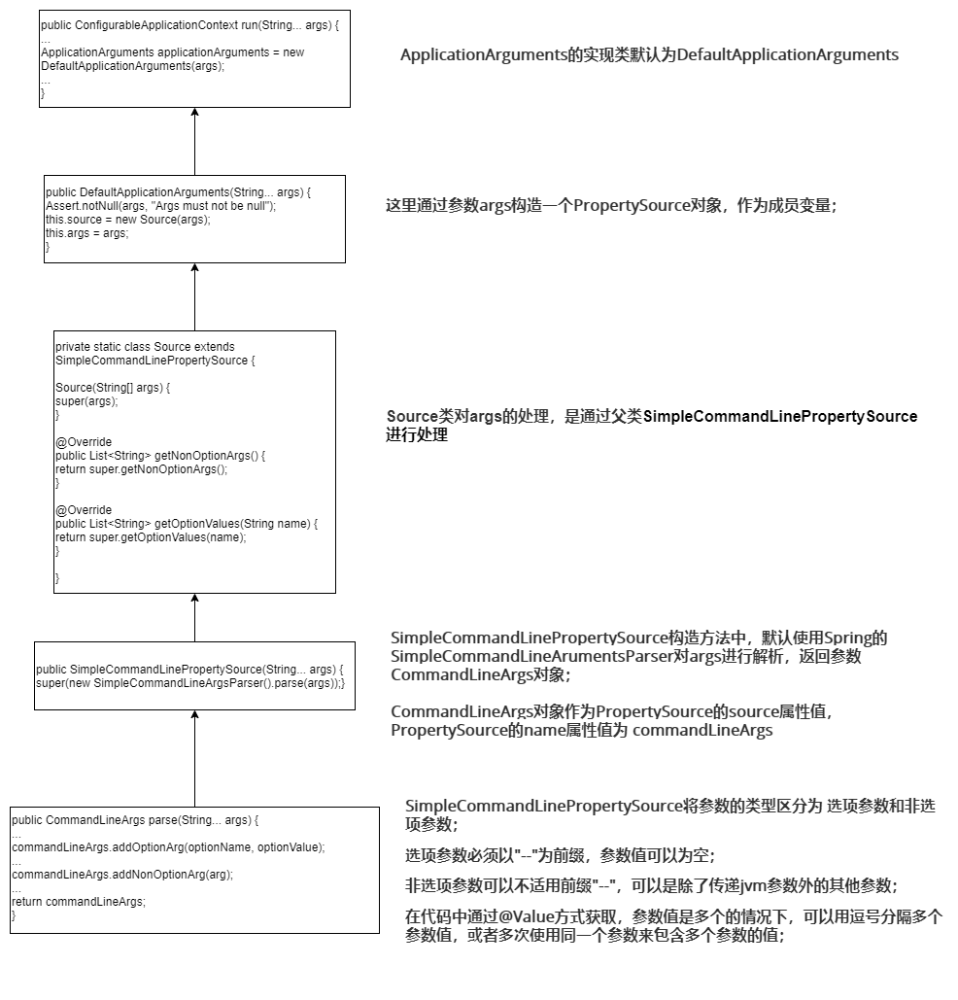
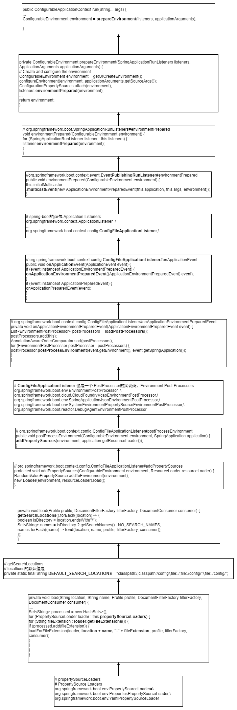

第5章

[TOC]

前面章节中讲解了SpringBoot的核心运作原理及启动过程中的一系列核心操作；本章开始，将针对在事件过程中应用的不同知识点的源代码进行解读和分析；

本章重点讲解SpringBoot外化配置文件相关内容，核心包括，外化配置文件，命令行参数，Profile实现机制和整个加载处理业务逻辑。

# 5.1 外化配置简介

可以通过使用属性文件,YAML文件，环境变量和命令行参数来进行外化配置；

通过@Value注解直接注入到对应的bean中，也可以使用Spring的Environment抽象访问，还可以通过@ConfigurationProperties绑定到结构化的对象上；

SpringBoot设计了很特殊的加载指定属性文件(PropertySource)的顺序，以允许对属性值进行合理的覆盖；

- **命令行参数；**
- 来自SPRING_APPLICATION_JSON的属性(内嵌在环境变量或系统属性中的内联JSON)；
- Java的系统属性(System.getProperties())
- 操作系统环境变量；
- jar包外的Profile-specific**应用属性**(application-{profile}.properties/yaml/yml)；
- jar包内的Profile-specific应用属性；
- jar包外的**应用配置**，application.properties/yaml/yml；
- jar包内的应用配置；
- 默认属性，SpringApplication.setDefaultProperties指定；

# 5.2 ApplicationArguments参数处理

通过SpringApplication.run(args)传入的args会被封装到ApplicationArguments接口中；

## 5.2.1 接口定义和初始化

```java
public interface ApplicationArguments {

   /**
    * Return the raw unprocessed arguments that were passed to the application.
    * @return the arguments
    */
   String[] getSourceArgs();

   /**
    * Return the names of all option arguments. For example, if the arguments were
    * "--foo=bar --debug" would return the values {@code ["foo", "debug"]}.
    * @return the option names or an empty set
    */
   Set<String> getOptionNames();

   /**
    * Return whether the set of option arguments parsed from the arguments contains an
    * option with the given name.
    * @param name the name to check
    * @return {@code true} if the arguments contain an option with the given name
    */
   boolean containsOption(String name);

   /**
    * Return the collection of values associated with the arguments option having the
    * given name.
    * 
    * @param name the name of the option
    * @return a list of option values for the given name
    */
   List<String> getOptionValues(String name);

   /**
    * Return the collection of non-option arguments parsed.
    * @return the non-option arguments or an empty list
    */
   List<String> getNonOptionArgs();

}
```

提供了针对参数名称和值的查询，以及判断是否存在指定参数的功能；



## 5.2.2 使用实例

可以通过注入 ApplicationArguments，来获取命令行相关的参数信息；

# 5.3 命令参数的获取


# 5.4 配置文件的加载

springboot启动的时候会自动加载classpath下的aplication.yml或application.properties文件，配置文件的加载过程主要利用SprintBoot的实践机制来完成的，即SpringApplicationRunListeners中的environmentPrepared方法来启动加载配置文件的事件。

该方法发布的事件会被注册的ConfigFileApplicationListener监听到，从而实现资源的加载；

源码过程如下：




# 5.5 基于Profile的处理实现


# 5.6 综合实践