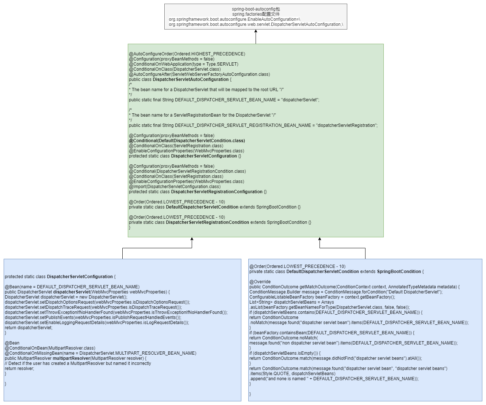
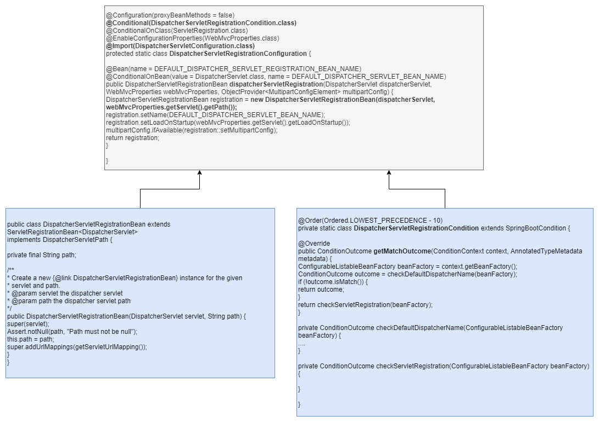
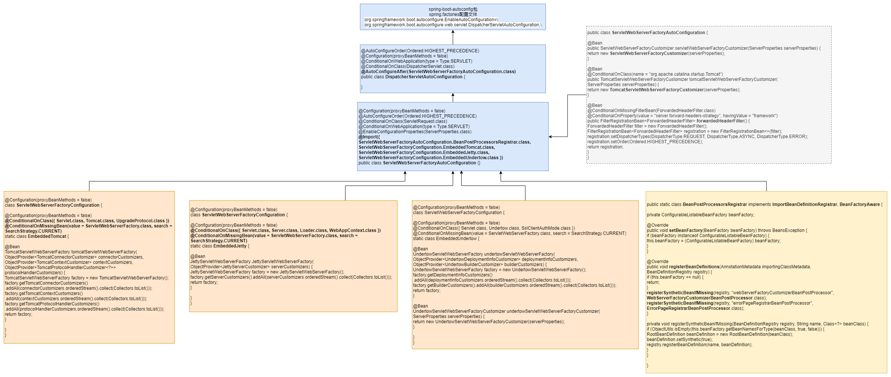
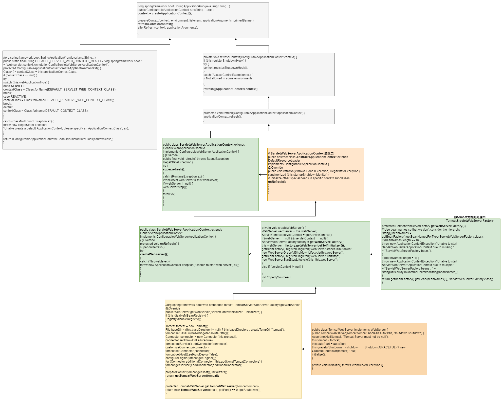
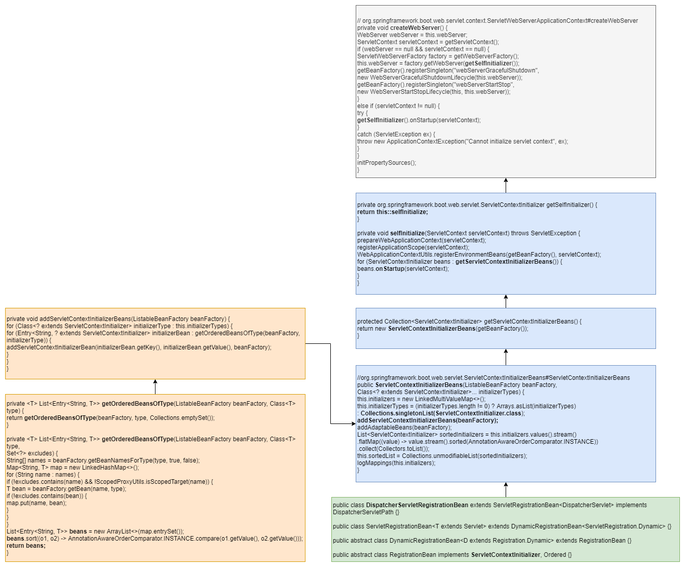

SprintBoot内置Servlet容器源码解析

[TOC]

SpringBoot是如何检测到对应额Servlet容器，又如何进行自动装配，对于之前自动配置的DispatcherServlet又是如何获取并注册的。本章带领大家学习SpringBoot集成Servlet Web容器及DIspatcherServlet的加载过程。

# 7.1 Web容器自动配置

## 7.1.1 Servlet Web服务器介绍

| Servlet容器 | Web容器的WebServer实现类 | WebServer的工厂类               |
| ----------- | ------------------------ | ------------------------------- |
| Tomcat      | TomcatWebServer          | TomcatServletWebServerFactory   |
| Jetty       | JettyWebServer           | JettyServletWebServerFactory    |
| Undertow    | UndertowWebServer        | UndertowServletWebServerFactory |

以上容器额实现类，均位于org.springframework.boot.web.embedded包下，

以Tomcat为例，先自动配置初始化TomcatServletWebServerFactory工厂类，在SpringBoot启动过程中，该工厂类通过getWebServer创建WebServlet实例，启动tomcat等一系列操作。

## 7.1.2 自动配置源码的分析

Servlet Web容器的核心配置就是上面提到的3个工厂类和BeanPostProcessor注册；

```java
@AutoConfigureAfter(ServletWebServerFactoryAutoConfiguration.class)
public class DispatcherServletAutoConfiguration {...}
```

web容器的自动配置类DispatcherServletAutoConfiguration中，配置有AutoConfigureAfter，该注解指定webServer容器的自动配置完成后，才进行DispatcherServlet的自动配置，本节主要讲 ServletWebServerFactoryAutoConfiguration 的自动配置过程；

用来自动配置Servlet的web服务的

```java
@Configuration(proxyBeanMethods = false)
@AutoConfigureOrder(Ordered.HIGHEST_PRECEDENCE)
@ConditionalOnClass(ServletRequest.class)
@ConditionalOnWebApplication(type = Type.SERVLET)
@EnableConfigurationProperties(ServerProperties.class)
@Import({ ServletWebServerFactoryAutoConfiguration.BeanPostProcessorsRegistrar.class,
      ServletWebServerFactoryConfiguration.EmbeddedTomcat.class,
      ServletWebServerFactoryConfiguration.EmbeddedJetty.class,
      ServletWebServerFactoryConfiguration.EmbeddedUndertow.class })
public class ServletWebServerFactoryAutoConfiguration {}
```

@Import注解引入4个类，其中3个为ServletWebServerFactoryConfiguration的内部类；

ServletWebServerFactoryConfiguration类中定义了3个内部类，一般通过@Import方式在其他自动配置类中使用，并且确保执行顺序。此处便是如此；

**EmbeddedTomcat**

分别通过@Bean的方式，实例化了3种WebServer工厂类；

```java
@Configuration(proxyBeanMethods = false)
class ServletWebServerFactoryConfiguration {

   @Configuration(proxyBeanMethods = false)
   @ConditionalOnClass({ Servlet.class, Tomcat.class, UpgradeProtocol.class })
   @ConditionalOnMissingBean(value = ServletWebServerFactory.class, search = SearchStrategy.CURRENT)
   static class EmbeddedTomcat {

      @Bean
      TomcatServletWebServerFactory tomcatServletWebServerFactory(
            ObjectProvider<TomcatConnectorCustomizer> connectorCustomizers,
            ObjectProvider<TomcatContextCustomizer> contextCustomizers,
            ObjectProvider<TomcatProtocolHandlerCustomizer<?>> protocolHandlerCustomizers) {
         TomcatServletWebServerFactory factory = new TomcatServletWebServerFactory();
         factory.getTomcatConnectorCustomizers()
               .addAll(connectorCustomizers.orderedStream().collect(Collectors.toList()));
         factory.getTomcatContextCustomizers()
               .addAll(contextCustomizers.orderedStream().collect(Collectors.toList()));
         factory.getTomcatProtocolHandlerCustomizers()
               .addAll(protocolHandlerCustomizers.orderedStream().collect(Collectors.toList()));
         return factory;
      }

   }
.....

}
```

EmbeddedTomcat的条件是类路径下存在Servlet.class, Tomcat.class, UpgradeProtocol.class 3个类，并且不存在ServletWebServerFactory；ConditionalOnMissingBean的三种搜索策略：搜索当前容器，搜索所有祖先容器(不包含当前)，搜索所有层级容器，默认为ALL；

tomcatServletWebServerFactory由3个ObjectProvider类型参数构成，ObjectProvider参数中的泛型类型依次包含TomcatConnectorCustomizer，TomcatContextCustomizer，TomcatProtocolHandlerCustomizer，它们均为回调接口；

分别用于Tomcat Connector/Context/ProtocalHandler的定制化处理，通过以上回调函数，可以在核心业务处理完成后，针对Tomcat再进行一些定制化操作；

ObjectProvider的应用，是专门为注入设计的，如果再构造函数中依赖某个bean可以通过@Autowired方式注入，如果是单构造函数，也可以省略；但是如果待注入参数为空或者有多个的情况下，便可以用ObjectProvider；ObjectProvider避免了注入对象为空的情况，并且如果有多个实例时，会根据Bean的实现的Ordered接口或者Order注解的先后顺序获取一个，从而提供一个更加宽松的注入方式；Spring5.1版本之后，提供了stream方式，正如该例子中的用法；

TomcatServletWebServerFactory中两个默认值，port和contextPath，

contextPath默认值在父类AbstractServletWebServerFactory中，默认为空字符串；

AbstractServletWebServerFactory的父类AbstractConfigurableWebServerFactory中定义了port的默认值8080


**BeanPostProcessorsRegistrar**

ServletWebServerFactoryAutoConfiguration中还引入了BeanPostProcessorsRegistrar，它是当前自动配置类的内部类，

```java
public static class BeanPostProcessorsRegistrar implements ImportBeanDefinitionRegistrar, BeanFactoryAware {

   private ConfigurableListableBeanFactory beanFactory;

   @Override
   public void setBeanFactory(BeanFactory beanFactory) throws BeansException {
      if (beanFactory instanceof ConfigurableListableBeanFactory) {
         this.beanFactory = (ConfigurableListableBeanFactory) beanFactory;
      }
   }

   @Override
   public void registerBeanDefinitions(AnnotationMetadata importingClassMetadata,
         BeanDefinitionRegistry registry) {
      if (this.beanFactory == null) {
         return;
      }
      registerSyntheticBeanIfMissing(registry, "webServerFactoryCustomizerBeanPostProcessor",
            WebServerFactoryCustomizerBeanPostProcessor.class);
      registerSyntheticBeanIfMissing(registry, "errorPageRegistrarBeanPostProcessor",
            ErrorPageRegistrarBeanPostProcessor.class);
   }

   private void registerSyntheticBeanIfMissing(BeanDefinitionRegistry registry, String name, Class<?> beanClass) {
      if (ObjectUtils.isEmpty(this.beanFactory.getBeanNamesForType(beanClass, true, false))) {
         RootBeanDefinition beanDefinition = new RootBeanDefinition(beanClass);
         beanDefinition.setSynthetic(true);
         registry.registerBeanDefinition(name, beanDefinition);
      }
   }

}
```

通过

实现ImportBeanDefinitionRegistrar接口，来注册一个webServerFactoryCustomizerBeanPostProcessor ；

实现BeanFactoryAware的setBeanFactory方法，设置beanFactory ;

ImportBeanDefinitionRegistrar用法：

1. 定义实现该接口的实现类，在registerBeanDefinitions方法中添加具体bean的注册功能；
2. 在@Configuration注解的配置类上通过@Import方式引入上述实现类；

此处注册的两个bean实现自接口BeanPostProcessor，属于bean的后置处理，作用是在bean初始化后，完成一些自己的逻辑；

WebServerFactoryCustomizerBeanPostProcessor的主要作用是在web Factory开始初始化时获取自动配置类注入的WebServerFactoryCustomizer,然后分别调用对应的customize方法，来进行WebServerFactory的定制化处理；

ErrorPageRegistrarBeanPostProcessor的作用是搜集容器中的ErrorPageRegistrar，添加当前应用所采用的ErrorPageRegistry中；


*TODO: beanFactory是如何完成自动注入的？*


**ServletWebServerFactoryAutoConfiguration中的其他内部代码**

```java
@Bean
public ServletWebServerFactoryCustomizer servletWebServerFactoryCustomizer(ServerProperties serverProperties) {
   return new ServletWebServerFactoryCustomizer(serverProperties);
}

@Bean
@ConditionalOnClass(name = "org.apache.catalina.startup.Tomcat")
public TomcatServletWebServerFactoryCustomizer tomcatServletWebServerFactoryCustomizer(
      ServerProperties serverProperties) {
   return new TomcatServletWebServerFactoryCustomizer(serverProperties);
}

@Bean
@ConditionalOnMissingFilterBean(ForwardedHeaderFilter.class)
@ConditionalOnProperty(value = "server.forward-headers-strategy", havingValue = "framework")
public FilterRegistrationBean<ForwardedHeaderFilter> forwardedHeaderFilter() {
   ForwardedHeaderFilter filter = new ForwardedHeaderFilter();
   FilterRegistrationBean<ForwardedHeaderFilter> registration = new FilterRegistrationBean<>(filter);
   registration.setDispatcherTypes(DispatcherType.REQUEST, DispatcherType.ASYNC, DispatcherType.ERROR);
   registration.setOrder(Ordered.HIGHEST_PRECEDENCE);
   return registration;
}
```

ServletWebServerFactoryCustomizer用来配置ServletWeb服务器的基本信息，比如通常在application.properteis中配置的serer.port=8080，会通过Serverproperties传递进行设置；

forwardedHeaderFilter的主要作用时注册了一个filter，用于重定向功能；

Servlet Web容器的自动配置完成了；


# 7.2 WebServer 初始化过程

WebServer的实现类有3个，TomcatWebServer,JettyWebServer,UndertowWebServer；

```java
public interface WebServer {

   void start() throws WebServerException;

   void stop() throws WebServerException;

   int getPort();
  ...
}
```

从SpringApplication的run方法开始：

```java
public ConfigurableApplicationContext run(String... args) {
  ...
   try {
      ...
      refreshContext(context);
      afterRefresh(context, applicationArguments);
     ...
   }
   catch (Throwable ex) {
      handleRunFailure(context, ex, exceptionReporters, listeners);
      throw new IllegalStateException(ex);
   }
  	...
   return context;
}
```

refreshContext方法中，调用了refresh方法

```java
private void refreshContext(ConfigurableApplicationContext context) {
   ...
   refresh((ApplicationContext) context);
}

protected void refresh(ApplicationContext applicationContext) {
    Assert.isInstanceOf(ConfigurableApplicationContext.class, applicationContext);
    refresh((ConfigurableApplicationContext) applicationContext);
}

protected void refresh(ConfigurableApplicationContext applicationContext) {
		applicationContext.refresh();
}
```

applicationContext是通过createApplicationContext方法进行实例化，在refreshContext方法之前完成；为通过当前webApplicationType的不同创建对应的context;

Servlet Web项目会默认创建AnnotationConfigServletWebServerApplicationContext类

在上述代码的refresh方法最后，调用的是context的refresh方法，该方法在对应context的父类ServletWebServerApplicationContext中定义：

```java
// org.springframework.boot.web.servlet.context.ServletWebServerApplicationContext#refresh
@Override
public final void refresh() throws BeansException, IllegalStateException {
   try {
      super.refresh();
   }
   catch (RuntimeException ex) {
      WebServer webServer = this.webServer;
      if (webServer != null) {
         webServer.stop();
      }
      throw ex;
   }
}
```

又调用ServletWebServerApplicationContext的父类中的refresh方法：

```java
@Override
public void refresh() throws BeansException, IllegalStateException {
   synchronized (this.startupShutdownMonitor) {
      ...
      try {
         // Initialize other special beans in specific context subclasses.
         onRefresh();
         ...
      }
      catch (BeansException ex) {
        ...
      }
      finally {
         // Reset common introspection caches in Spring's core, since we
         // might not ever need metadata for singleton beans anymore...
         resetCommonCaches();
      }
   }
}
protected void onRefresh() throws BeansException {
		// For subclasses: do nothing by default.
}
```

onFresh方法回到ServletWebServerApplicationContext中：

```java
@Override
protected void onRefresh() {
   super.onRefresh();
   try {
      createWebServer();
   }
   catch (Throwable ex) {
      throw new ApplicationContextException("Unable to start web server", ex);
   }
}


private void createWebServer() {
    WebServer webServer = this.webServer;
    ServletContext servletContext = getServletContext();
    if (webServer == null && servletContext == null) {
        ServletWebServerFactory factory = getWebServerFactory();
        this.webServer = factory.getWebServer(getSelfInitializer());
        getBeanFactory().registerSingleton("webServerGracefulShutdown",
                                           new WebServerGracefulShutdownLifecycle(this.webServer));
        getBeanFactory().registerSingleton("webServerStartStop",
                                           new WebServerStartStopLifecycle(this, this.webServer));
    }
    else if (servletContext != null) {
        ...
    }
    initPropertySources();
}	
```

第一次进入该方法的时候，webServer和servletContext均为空，进入第一个if判断中：

```java
protected ServletWebServerFactory getWebServerFactory() {
   // Use bean names so that we don't consider the hierarchy
   String[] beanNames = getBeanFactory().getBeanNamesForType(ServletWebServerFactory.class);
   if (beanNames.length == 0) {
      throw new ApplicationContextException("Unable to start ServletWebServerApplicationContext due to missing "
            + "ServletWebServerFactory bean.");
   }
   if (beanNames.length > 1) {
      throw new ApplicationContextException("Unable to start ServletWebServerApplicationContext due to multiple "
            + "ServletWebServerFactory beans : " + StringUtils.arrayToCommaDelimitedString(beanNames));
   }
   return getBeanFactory().getBean(beanNames[0], ServletWebServerFactory.class);
}
```

该方法，校验了ServletWebServerFactory实现类的数目，保证有且仅有1个，它的实现类有Tomcat,Jetty和Undertow；

以tomcat为例，这里的factory就是TomcatServletWebServerFactory的实例化对象；

调用它的getWebServer方法获得weServer对象：

```java
// org.springframework.boot.web.embedded.tomcat.TomcatServletWebServerFactory#getWebServer
@Override
public WebServer getWebServer(ServletContextInitializer... initializers) {
   if (this.disableMBeanRegistry) {
      Registry.disableRegistry();
   }
    // 内置tomcat包中提供的类
   Tomcat tomcat = new Tomcat();
    // 获取并设置baseDir的路径，如果没有则创建一个以tomcat为首的前缀的临时文件
   File baseDir = (this.baseDirectory != null) ? this.baseDirectory : createTempDir("tomcat");
   tomcat.setBaseDir(baseDir.getAbsolutePath());
   Connector connector = new Connector(this.protocol);
   connector.setThrowOnFailure(true);
   tomcat.getService().addConnector(connector);
   customizeConnector(connector);
   tomcat.setConnector(connector);
   tomcat.getHost().setAutoDeploy(false);
   configureEngine(tomcat.getEngine());
   for (Connector additionalConnector : this.additionalTomcatConnectors) {
      tomcat.getService().addConnector(additionalConnector);
   }
   prepareContext(tomcat.getHost(), initializers);
   return getTomcatWebServer(tomcat);
}
```

实现了tomcat的创建，basedir的设置，connector的初始化和定制化等一些列初始化操作；

方法最后的getTomcatWebServer(tomcat) 创建了WebServer对象；

```java
protected TomcatWebServer getTomcatWebServer(Tomcat tomcat) {
   return new TomcatWebServer(tomcat, getPort() >= 0, getShutdown());
}
```

子类可以重写该方法，从而实现一个不同的TomcatWebServer或者添加一些额外的操作；

TOmcatWebServer构造方法

```java
public TomcatWebServer(Tomcat tomcat, boolean autoStart, Shutdown shutdown) {
   Assert.notNull(tomcat, "Tomcat Server must not be null");
   this.tomcat = tomcat;
   this.autoStart = autoStart;
   this.gracefulShutdown = (shutdown == Shutdown.GRACEFUL) ? new GracefulShutdown(tomcat) : null;
   initialize();
}
```

调用了initialize方法：

```java
private void initialize() throws WebServerException {
   logger.info("Tomcat initialized with port(s): " + getPortsDescription(false));
   synchronized (this.monitor) {
      try {
         addInstanceIdToEngineName();

         Context context = findContext();
         context.addLifecycleListener((event) -> {
            if (context.equals(event.getSource()) && Lifecycle.START_EVENT.equals(event.getType())) {
               // Remove service connectors so that protocol binding doesn't
               // happen when the service is started.
               removeServiceConnectors();
            }
         });

         // Start the server to trigger initialization listeners
         this.tomcat.start();

         // We can re-throw failure exception directly in the main thread
         rethrowDeferredStartupExceptions();

         try {
            ContextBindings.bindClassLoader(context, context.getNamingToken(), getClass().getClassLoader());
         }
         catch (NamingException ex) {
            // Naming is not enabled. Continue
         }

         // Unlike Jetty, all Tomcat threads are daemon threads. We create a
         // blocking non-daemon to stop immediate shutdown
         startDaemonAwaitThread();
      }
      catch (Exception ex) {
         stopSilently();
         destroySilently();
         throw new WebServerException("Unable to start embedded Tomcat", ex);
      }
   }
}
```

重命名tomcat引擎名称，对context添加生命周期监听事件，启动服务触发初始化监听，检查Tomcat Starter对象是否存在，及Container状态是否正确，绑定命名到类加载器，启动守护等待线程等。

至此，tomcat的webServer的初始化已经完成；

# 7.3 DispatcherServlet 的加载过程

## 7.3.1 DIspatcherServlet的获取

在上一章中，有介绍DIspatcherServlet和DispatcherServletRegistrationBean;

回顾上节的ServletWebServerApplicationContext的createWebServer()方法：

```java
private void createWebServer() {
   WebServer webServer = this.webServer;
   ServletContext servletContext = getServletContext();
   if (webServer == null && servletContext == null) {
      ServletWebServerFactory factory = getWebServerFactory();
      this.webServer = factory.getWebServer(getSelfInitializer());
      getBeanFactory().registerSingleton("webServerGracefulShutdown",
            new WebServerGracefulShutdownLifecycle(this.webServer));
      getBeanFactory().registerSingleton("webServerStartStop",
            new WebServerStartStopLifecycle(this, this.webServer));
   }
   else if (servletContext != null) {
      try {
         getSelfInitializer().onStartup(servletContext);
      }
      catch (ServletException ex) {
         throw new ApplicationContextException("Cannot initialize servlet context", ex);
      }
   }
   initPropertySources();
}
```

其中在分支逻辑中都用到了方法 getSelfInitializer，

```java
private org.springframework.boot.web.servlet.ServletContextInitializer getSelfInitializer() {
   return this::selfInitialize;
}

private void selfInitialize(ServletContext servletContext) throws ServletException {
   prepareWebApplicationContext(servletContext);
   registerApplicationScope(servletContext);
   WebApplicationContextUtils.registerEnvironmentBeans(getBeanFactory(), servletContext);
   for (ServletContextInitializer beans : getServletContextInitializerBeans()) {
      beans.onStartup(servletContext);
   }
}
```

上述通过匿名类的方式创建了一个ServletContextInitializer的实现类，并且新建了该对象；等价于：

```java
private org.springframework.boot.web.servlet.ServletContextInitializer getSelfInitializer() {
   return new ServletContextInitializer(){
       @Override
       public void onStartUp(ServletContext context) throw ServletException{
           selfInitialize(context);
       }
   }
}
```

注意，这里仅是创建了子类的实现对象，并没有调用实际的selfInitialize方法；

selfInitialize方法，首先 通过servletContext准备webApplicationContext和进行一些注册操作；然后，最重要的是，得到ServletContextInitializer集合，并遍历其元素的onStartup方法；ServletContextInitializer#onStartup方法主要作用是配置指定的ServletContext所需的Servlet，过滤器，监听器上下文参数和属性等；

```java
protected Collection<ServletContextInitializer> getServletContextInitializerBeans() {
   return new ServletContextInitializerBeans(getBeanFactory());
}
```

ServletContextInitializerBeans对象就是一个从ListableBeanFactory中获取的ServletContextinitializer的集合。包括所有的ServletContextinitializer的bean，还是用于servlet,FIlter,和某些EventListener的bean；

```java
// org.springframework.boot.web.servlet.ServletContextInitializerBeans#ServletContextInitializerBeans
public ServletContextInitializerBeans(ListableBeanFactory beanFactory,
      Class<? extends ServletContextInitializer>... initializerTypes) {
   this.initializers = new LinkedMultiValueMap<>();
   this.initializerTypes = (initializerTypes.length != 0) ? Arrays.asList(initializerTypes)
         : Collections.singletonList(ServletContextInitializer.class);
   addServletContextInitializerBeans(beanFactory);
   addAdaptableBeans(beanFactory);
   List<ServletContextInitializer> sortedInitializers = this.initializers.values().stream()
         .flatMap((value) -> value.stream().sorted(AnnotationAwareOrderComparator.INSTANCE))
         .collect(Collectors.toList());
   this.sortedList = Collections.unmodifiableList(sortedInitializers);
   logMappings(this.initializers);
}
```

首先，这里initializerTypes参数为空，所以它默认为ServletCotextinitializer.class;

**addServletContextInitializerBeans**

然后，addServletContextInitializerBeans获取之前自动配置时注册的DispatcherServletRegistrationBean

```java
// org.springframework.boot.web.servlet.ServletContextInitializerBeans#addServletContextInitializerBeans
private void addServletContextInitializerBeans(ListableBeanFactory beanFactory) {
   for (Class<? extends ServletContextInitializer> initializerType : this.initializerTypes) {
      for (Entry<String, ? extends ServletContextInitializer> initializerBean : getOrderedBeansOfType(beanFactory,
            initializerType)) {
         addServletContextInitializerBean(initializerBean.getKey(), initializerBean.getValue(), beanFactory);
      }
   }
}
```

这里外层for循环只会有一次，二层for循环中也只一个值ServletContextInitializer类；

而DispatcherServletRegistrationBean本身就是一个ServletContextInitializer接口类的实现类；

```java
public class DispatcherServletRegistrationBean extends ServletRegistrationBean<DispatcherServlet>
      implements DispatcherServletPath{}
```

```java
public class ServletRegistrationBean<T extends Servlet> extends DynamicRegistrationBean<ServletRegistration.Dynamic> {}
```

```java
public abstract class DynamicRegistrationBean<D extends Registration.Dynamic> extends RegistrationBean {}

public abstract class RegistrationBean implements ServletContextInitializer, Ordered
```

至此，可以获取注入的DispatcherServletRegistrationBean，从而可以间接拿到DispatcherServlte对象；

**ServletContextInitializerBeans的addAdaptableBeans**

会加载默认的Filter对象，比如CharacterEncodingFilter，RequestContextFilter等；


经过上面的追踪，我们只是发现了DispatcherServlet是通过DiispatcherServletRegistrationBean被注册到了一个ServletContextInitializer匿名类中，但此时并未触发加载的操作；

## 7.3.2 DispatcherServlet的加载

追踪ServletContextInitializer的匿名类何时被调用，回到ServletWebServerApplication的createWebServer方法中，该方法通过调用factory.getWebServer()方式，将匿名类作为参数传递下去；

以TomcatServletWebServerFactory为例，

```java
prepareContext(tomcat.getHost(), initializers);
```

将匿名类传递给了prepareContext方法,

```java
protected void prepareContext(Host host, ServletContextInitializer[] initializers) {
   ...
   ServletContextInitializer[] initializersToUse = mergeInitializers(initializers);
   host.addChild(context);
   configureContext(context, initializersToUse);
   postProcessContext(context);
}
```

initializers参数首先经历和合并操作，通过抽象类AbstractServletWebServerFactory提供的mergeInitializers方法完成，将指定的initializers和当前实例中的参数组合在一起，供子类使用；这里的子类就是 TomcatServletWebServerFactory;

然后传递给configureContext方法，

```java
protected void configureContext(Context context, ServletContextInitializer[] initializers) {
   TomcatStarter starter = new TomcatStarter(initializers);
    ...
}
```

这里首先完成了TomcatStarter实例化操作，而initializers作为参数传入，最终由tomcatStarter的onStartup方法触发；

```java
@Override
public void onStartup(Set<Class<?>> classes, ServletContext servletContext) throws ServletException {
   try {
      for (ServletContextInitializer initializer : this.initializers) {
         initializer.onStartup(servletContext);
      }
   }
   catch (Exception ex) {
     ...
   }
}
```

那么tomcatStarter的onStartup方法是如何触发的呢？

在TomcatWebServer的初始化方法中：

```java
public TomcatWebServer(Tomcat tomcat, boolean autoStart, Shutdown shutdown) {
   Assert.notNull(tomcat, "Tomcat Server must not be null");
   this.tomcat = tomcat;
   this.autoStart = autoStart;
   this.gracefulShutdown = (shutdown == Shutdown.GRACEFUL) ? new GracefulShutdown(tomcat) : null;
   initialize();
}
private void initialize() throws WebServerException {
...
this.tomcat.start();
...
}
```

DispatcherServletRegistrationBean的onStartUp方法，在其父类中：

```java
// RegistrationBean
@Override
	public final void onStartup(ServletContext servletContext) throws ServletException {
		String description = getDescription();
		if (!isEnabled()) {
			logger.info(StringUtils.capitalize(description) + " was not registered (disabled)");
			return;
		}
		register(description, servletContext);
	}
```

其中register是由类DynamicRegistrationBean实现：

```java
@Override
	protected final void register(String description, ServletContext servletContext) {
		D registration = addRegistration(description, servletContext);
		if (registration == null) {
			logger.info(StringUtils.capitalize(description) + " was not registered (possibly already registered?)");
			return;
		}
		configure(registration);
	}

	protected abstract D addRegistration(String description, ServletContext servletContext);
```

addRegistration方法是类ServletRegistrationBean实现：

```java
@Override
protected ServletRegistration.Dynamic addRegistration(String description, ServletContext servletContext) {
   String name = getServletName();
   return servletContext.addServlet(name, this.servlet);
}
```

这里的this.servlet就是把当前的Dispatcherservlet添加到传入的context中；


DispatcherServlet是整个SpringMVC的核心组件之一，通过该组件的追踪和讲解，我们了解了他在spring boot中的整个运行过程，而且能够学会一套追踪，分析代码的实现速录；


# 7.4 综合实践

通过代码的形式来对servlet容器进行配置：

方案1：

构造一个实现了WebServerFactoryCustomizer的类，设置factory的对应参数，达到目的；


方案2：

定制化webServerFactory，比如

新建一个配置类，通过@Bean的方式实例化一个TomcatSrvletWebServerFactory类，其中实例化的过程中，调整一些指定的配置的操作；


# 7.5 小结

本章以Tomcat为了讲解了SpringBoot中servlet容器的初始化及启动过程；


**DispatcherServlet的自动配置过程？调用加载过程？图解**


总结第6-7章：

1. dispatcherServlet自动装配图；
2. dispatcherServletRegistrationBean自动配置图；
3. servlet web自动配置图；
4. webServer的创建过程；
5. dispatcherServlet的获取流程图；
6. dispatcherServlet的加载流程图；